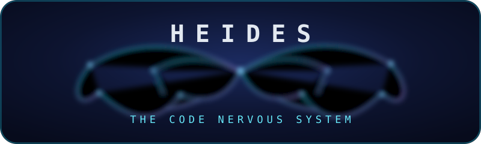

# HEIDES

## The code nervous system

HEIDES is a deterministic harness that gives AI coding agents what they do not have on their own: senses, memory and judgment for code. Before an agent touches anything, HEIDES maps the entire codebase into a persistent graph, derives warnings and edge cases from that map, and grounds every plan against reality. The agent suggests. HEIDES decides what is safe.

HEIDES does not compete with agents. It is the substrate beneath them. One binary, no cloud, no model required for the core. It runs on a laptop, a server, a CI runner, and a phone running Termux.

## Why it exists

An AI agent is powerful and blind. It can generate a perfect function and still break three callers it never saw, because it has no persistent map of the code. Linters and tests catch that damage after it lands, and only on paths that actually run. The classic failure: an agent changes a signature, unexercised call sites break, the test suite stays green, and production breaks at two in the morning.

HEIDES closes that gap at the moment that matters: before the patch is applied. It answers questions no tool answers in that instant. Who calls this function? Which imports does this file really use? Does this change conflict with the current graph? Is user input flowing into a SQL string, a shell, or a prompt?

## Architecture

HEIDES is three organs over one spine, all deterministic, all local, all explainable.

### The Spine

Perception and memory. The Spine walks the codebase and builds a compact persistent graph: symbols, files, callers, callees, imports and dataflow. The index lives on disk in the workspace and is updated incrementally as files change. Every later query, from Harmony guards to Grounding plans to the agent itself, reads the same map. No model is involved. This layer is pure analysis.

### Harmony

Judgment. Harmony runs the guard modules against the Spine graph and against proposed patches. Every guard is deterministic and reports evidence, never guesses.

* Staged apply. Compares current code against proposed code and blocks conflicts before anything is written to disk.
* Edge cases. Flags missing null, empty, error path and boundary handling on every changed function.
* Security taint. Traces user input into SQL, shell, filesystem and prompt sinks.
* Dependency. Detects upgrades that break the imports this project actually uses.
* Practices. Surfaces violations of project conventions.

Warnings are delivered the way a senior reviewer would deliver them: a file, a line, a severity, and the reason.

### Grounding

Refinement. Grounding takes an objective or a plan and checks it against the Spine and against the outside world. It confirms feasibility, surfaces missing prerequisites, and returns a bounded specification that the agent then builds against. For new projects it turns a plan into a scaffold, confirms security and best practices, and hands a clean foundation back to the agent. For facts that change over time it can consult the web and update its own knowledge.

## How it works

HEIDES is event driven. It wakes when a session starts or a file changes, works, and sleeps when the job is done. Nothing is stale because everything recomputes on demand against the persistent index.

1. The agent or user summons HEIDES before any change.
2. The Spine maps the codebase and saves the index.
3. Harmony derives warnings, edge cases and security notes from the map.
4. The user states the objective. Grounding refines it: this is not feasible as stated, it needs these pieces, this variant is sound.
5. The agent builds against the grounded spec while HEIDES guards every proposed patch.
6. The job ends. HEIDES goes dormant until the next trigger.

## Connectivity

One core, every shell. The same binary speaks to everything.

* CLI. Native commands: scan, status, query, check, staged, plan, scaffold, deps, watch and mcp.
* MCP. A Model Context Protocol server over stdio. Any MCP aware agent, editor or harness attaches directly.
* Agent systems. Claude Code, Codex, Cursor, OpenCode, Hermes and custom builds via MCP.
* Skills. HEIDES exposes its capabilities as MCP tools and resources, so skill systems can compose it.
* VS Code. Native MCP support in VS Code attaches to the same server. An extension is planned.
* Mobile. The same static binary runs on Android Termux and other Unix systems.

No ports, no daemon protocol, no cloud account. Just one process on stdio.

## Supported languages

Deep analysis (taint, dataflow, call graph) targets the primary set: JavaScript, TypeScript, Python, Java, C#, Go, Rust, PHP, Ruby, C, C++, Kotlin and Swift. Every other language is covered by structural analysis through tree sitter: conflict checks, imports and practices. AI system files are first class: agent configs, MCP server manifests, prompt files, notebooks and dependency manifests are modeled as their own file kinds.

## Install

Requirements: a Rust toolchain to build from source, or a prebuilt binary from releases.

    git clone git@github.com:AbduljabbarBXR/heides.git
    cd heides
    cargo build
    cp target/debug/heides ~/.local/bin/heides

## Quick start

    cd your_project
    heides scan

The Spine maps the codebase and saves the index under `.heides`.

    heides status

Shows the state of the index.

    heides query callers send_order

Asks the graph who calls a symbol, who imports a module, where a definition
lives, and what a function calls.

    heides check

Runs every guard against the workspace and prints findings with a file, a
line, a severity, and the reason.

    heides staged patch.diff

Checks an agent proposed diff before anything is applied. Signature changes,
removed symbols, duplicate definitions and deleted files are blocked with the
exact call sites that would break.

    heides plan "refactor the checkout_flow"

Grounds an objective against the spine. Confirmed symbols, missing symbols
and path facts come back before the agent starts.

    heides scaffold "rust cli tool" my_app

Turns a plan into a starter project and indexes it immediately.

    heides deps

Checks dependencies against the OSV vulnerability database and the latest
published versions.

    heides watch

Stays alive and reindexes on demand as files change.

    heides mcp

Starts the MCP server on stdio. Point any MCP client at it.

Example VS Code settings fragment:

    {
      "mcp": {
        "servers": {
          "heides": {
            "command": "heides",
            "args": ["mcp"]
          }
        }
      }
    }

## Design principles

* Deterministic first. A rule that is provable beats a model that is plausible. Models are reserved for the parts that need them.
* Explainable always. Every warning carries a file, a line and a reason. No black boxes.
* Local and small. One binary, an SQLite index, low memory. No cloud dependency, no telemetry by default.
* Model agnostic. HEIDES does not care which model drives the agent. It guards the code, not the model.
* Agent agnostic. Any tool that can run a process and read stdio can use it.
* Alive, not stale. Event driven wakeups, incremental index updates, on demand recompute.

## Project status

This is milestone two: a working deterministic harness. The Spine parses
Rust, JavaScript, TypeScript and Python with tree sitter and builds symbols,
call edges, import edges and signatures into a persistent index. Harmony runs
the staged apply guard, edge case checks, security taint tracking (SQL,
shell, filesystem and prompt injection), best practice rules and the OSV
dependency check. Grounding evaluates plans against the graph, scaffolds new
projects, and confirms facts against the package registries on the web. The
MCP server exposes every capability as a tool, and the watch loop keeps the
index fresh. The whole harness ships as one binary that runs on desktop,
server, CI and Termux.

Every change lands behind the same gate: lint, build, the unit suite, and the
serial battle suite of forty three end to end checks run against a real
fixture workspace, including MCP round trips and dash free output
enforcement.

The roadmap: more languages in the deep set (Go, PHP, Java, C#), incremental
index updates, interprocedural taint flow, upgrade breakage analysis against
the graph, and a TUI panel for reviewing guard output while the agent works.

## Development

    cargo build
    cargo test
    cargo run scan
    cargo run mcp

The codebase is small on purpose. Each organ lives in its own module and exposes a plain interface so the project stays understandable as it grows.

## License

MIT. See the LICENSE file.
