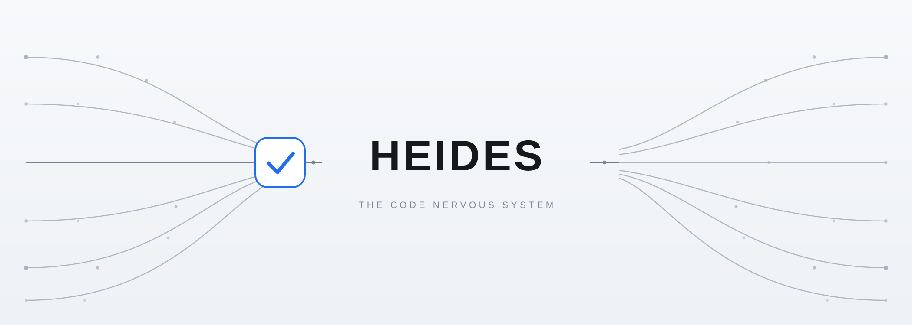
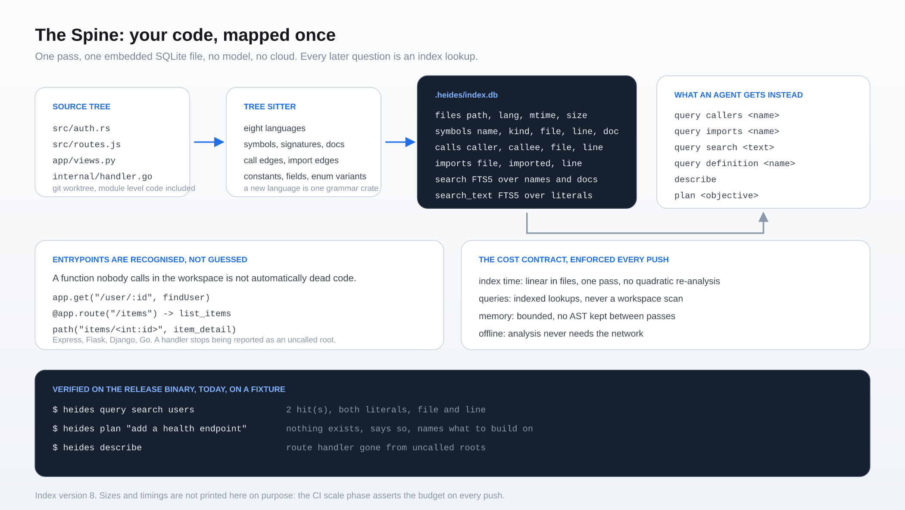
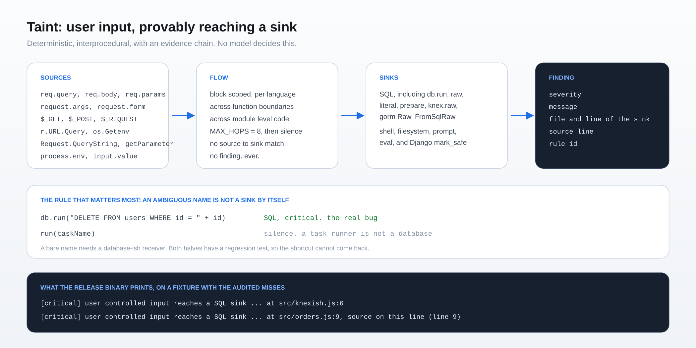
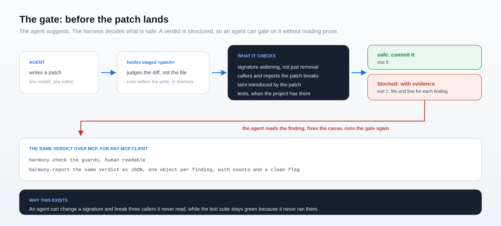

# HEIDES



## The code nervous system

HEIDES is a deterministic harness that gives AI coding agents what they do not have on their own: a persistent map of the code, warnings derived from that map, and a verdict before a patch lands. The agent suggests. HEIDES decides what is safe.

One binary. No cloud, no model, no account. It runs on a laptop, on a server, in CI, and on a phone running Termux.

```sh
heides scan                 # map the codebase once
heides check                # run every guard
heides staged patch.diff    # judge a patch before it lands
heides mcp                  # expose it to any MCP client
```

Every guard except one is local analysis. The dependency guard is the only one
that queries a registry, and it says so instead of doing it behind your back:

```sh
heides check --no-deps       # or HEIDES_OFFLINE=1
```

On this repository that is the difference between 217 seconds and 2. Manifest
parsing and pinned version extraction are local, so an offline check still reads
all 94 pinned versions and reports them. What it gives up is the known-CVE
lookup and the "a newer version exists" reminder, and the coverage receipt says
the lookup was skipped rather than reporting a partial run as a complete one.

## Why it exists

An AI agent is powerful and blind. It can write a perfect function and still break three callers it never read, because it has no persistent map of the code. Linters and tests catch that after the change lands, and only on paths that happen to run. The classic failure: an agent changes a signature, the unexercised call sites break, the suite stays green, and production breaks at two in the morning.

HEIDES closes that gap at the moment that matters, before the write. It answers the questions no other tool answers at that instant. Who calls this function? Which imports does this file really use? Does this patch conflict with the graph? Is user input flowing into a SQL string, a shell, or a prompt?

## The Spine



HEIDES walks the tree once and builds a persistent graph in one embedded SQLite file: files, symbols with their captured doc comments, call edges, import edges, and two FTS5 tables, one over names and docs, one over literals and comments. Every later question is an index lookup, so an agent asks the graph instead of reading files.

The spine is not a model and not a guess. `heides describe` reads the whole workspace manifest in one shot, including entrypoints, hubs and doc coverage per language. A function nobody calls in the workspace is not automatically dead code: Express, Flask, Django and Go route registrations are recognised, so a handler stops being reported as an uncalled root.

The cost contract is enforced on every push by the CI scale phase, not by a number frozen into this file: index time linear in files, queries on indexes, bounded memory, and analysis that never needs the network.

## Taint



Taint is the part that finds real bugs. Sources are request data and environment reads per language. Flow is tracked block scoped, across function boundaries and across module level code, with a hop cap and silence past it. Sinks include SQL, SSRF, NoSQL, shell, filesystem, prompt, eval and Django's `mark_safe`.

SSRF and NoSQL use a stricter gate than SQL on purpose. A hardcoded health-check URL and a literal query object inside a request handler are both safe, so those rules require the tainted value to actually reach the sink line rather than merely a source existing somewhere in the handler:

```js
app.get('/health', async (req, res) => {
  const id = req.query.id;                              // a source is in scope here
  const r = await fetch('https://api.internal/health'); // ...and this must stay silent
});
```

A tainted fetch aimed at a cloud metadata address is reported as credential theft rather than as a generic SSRF, because that is what it is:

```
user controlled input reaches a cloud metadata fetch sink on this line. source at line 4
```

The report only claims what it can see. A tainted host passed in through a variable is reported as SSRF, because the address never appears on the line and the tool will not guess where it points.

The rule that matters most is restraint. `run`, `raw`, `literal` and `prepare` are ambiguous names, so they only count as SQL on a database-ish receiver:

```js
db.run("DELETE FROM users WHERE id = " + id)   // critical SQL finding
run(taskName)                                  // silence, a task runner is not a database
```

The same applies to a document query, where the method name alone is ambiguous but the receiver is not:

```js
UserModel.find(JSON.parse(req.query.filter))  // critical NoSQL finding
items.find(i => i.id === id)                  // silence, that is an array method
```

Both halves have a regression test, so the shortcut cannot come back.

### Languages

Taint and indexing are separate, and the table is honest about which is which.

| Language | Indexed with symbols | Taint scanned |
|---|---|---|
| JavaScript, TypeScript, Python, PHP, Go, Java, C# | yes | yes |
| Ruby | no grammar yet | yes |
| HTML, CSS | yes | no |
| Rust | yes | no |

TypeScript was silently unscanned for taint until 0.16.0: the parser mapped `.ts` to `typescript` and the rule tables had no `typescript` rows, so every TypeScript file was skipped without a word. Ruby could not taint at all until this release, for three separate reasons: no `rb` extension, no source row, and a block detector that understood braces but not `def` and `end`. Rust is indexed but not taint scanned, so a shell or SQL sink in Rust code is not reported.


## The gate



`heides staged` is the part an agent loop actually uses. It judges the diff, not the file: signature widening and not just removal, callers and imports the patch breaks, taint the patch introduces, and the project's own tests when it has them. The verdict is structured, so an agent can gate on it without parsing prose, and it exits non-zero with a file and a line for every finding.

## Install

One line installer, downloads the prebuilt binary for linux, macos, windows and Termux Android.

```sh
curl -fsSL https://raw.githubusercontent.com/AbduljabbarBXR/heides/main/scripts/install.sh | bash
```

Pin a version with `HEIDES_VERSION`. It takes a bare version, and a leading `v` is stripped, so both `0.16.0` and `v0.16.0` work. The npm installer reads the same variable, so one pin covers both paths.

```sh
# any published tag, bare or with a leading v
HEIDES_VERSION=v0.16.0 curl -fsSL https://raw.githubusercontent.com/AbduljabbarBXR/heides/main/scripts/install.sh | bash
```

Or install from npm, no Rust toolchain needed:

```sh
npm install -g heides
```

Or with cargo:

```sh
cargo install heides
```

Or take a prebuilt binary for your platform from the releases page, or build from source
with `cargo build --release`.

Every channel is on the same version, and a test fails the build if the npm wrapper and the
binary ever drift apart.

## Quick start

```sh
heides scan                       # build the spine index
heides check                      # every guard, human readable
heides query callers send_order   # who calls it
heides query search refresh       # names, docs, literals and comments
heides describe                   # the workspace manifest in one shot
heides plan "add a health endpoint"   # is this plan grounded in what exists
heides staged patch.diff          # judge a patch before applying it
heides mcp                        # serve the eleven tools over stdio
```

A worked example, on a small Express service where two bugs are planted:

```sh
$ heides check
0 blocker(s), 3 critical, 0 warning(s), 1 info

[critical] user controlled input reaches a SQL sink ... at src/knexish.js:6
[critical] user controlled input reaches a SQL sink ... at src/knexish.js:7
[critical] user controlled input reaches a SQL sink ... at src/orders.js:9
[info] no dependency manifests found

$ heides query search users
2 hit(s)
SELECT * FROM users WHERE email = (literal) at src/knexish.js:5
DELETE FROM users WHERE id = (literal) at src/orders.js:9

$ heides plan "add a health endpoint"
feasible true
  no identifier in this plan exists in the spine. this plan introduces new definitions.
  existing functions to build on or replace: findUser, greet at src/clean.js:1
  spine holds 4 file(s) and 5 symbol(s). index version 8.
```

## MCP tool reference

The server exposes eleven tools over stdio, for any MCP client.

* `spine.scan`. Map the current codebase into the persistent index.
* `spine.query`. Who calls a symbol, who imports a module, where a definition lives, what a function calls, or free text search over names, signatures, docs, literals and comments.
* `spine.describe`. The workspace manifest in one call: languages, counts, entrypoints, hubs, doc coverage.
* `spine.neighbors`. Every side of a symbol: definition with its captured doc, its callers, its calls.
* `harmony.check`. Run every guard, findings with evidence.
* `harmony.report`. The same verdict as structured JSON with severity counts and a clean flag.
* `harmony.staged`. Check a unified diff before applying it.
* `grounding.plan`. Evaluate a plan against the codebase, with the evidence it used.
* `grounding.scaffold`. Scaffold a new project from a plan and index it immediately.
* `deps.check`. Known vulnerabilities and outdated versions from the manifests.
* `web.confirm`. Confirm a fact against the package registries.

## Security model

* Deterministic by design. Every finding carries a file, a line, a reason and a rule id. No black boxes.
* Local by default. Nothing leaves the machine except the explicit web calls for dependency checks and grounding.
* No telemetry, no analytics, no account, no ports, no daemon protocol. One process on stdio.
* One static binary with no runtime dependencies.
* The MCP server reads raw bytes so binary input can never kill it, and caps message size.

## Use cases

* A guardrail for agentic coding sessions in the terminal.
* Pre-merge review for AI generated pull requests, in CI or over MCP.
* Onboarding an agent to an unfamiliar codebase without reading the whole tree.
* Security review of agent applications, especially prompt injection.
* Dependency hygiene for older projects.

## What is not done yet

Stated plainly, and tracked with citations and a resolution column in `ROADMAP.md`. Two things about this list are worth being explicit about. A gap listed here is a limit you can plan around; a silent no-op is not, and one shipped in 0.15.2, where a check on a never-indexed workspace reported a clean workspace. That specific defect is now pinned by two tests: one asserts a freshly built graph can read back every file it lists, the other asserts a first run over an unindexed tainted file reports it.

* No database layer yet. There is no `.sql` parsing, no schema graph, no way to ask which code touches a table. This is the largest known gap. Note this is a missing *database* layer, not a missing store: the spine is already one embedded SQLite file, so this extends an existing store rather than introducing one.
* No API surface graph, so nothing answers "what does `POST /users` end up writing to" in one call. This is the flagship item.
* Path traversal beyond the filesystem write sinks, and no command injection rule for framework-specific shell APIs.
* No open redirect, XXE, unsafe deserialization or crypto misuse rules.
* A handful of ecosystems are not read for dependencies: Ruby, .NET, Swift, Gradle, Dart, and no transitive resolution from lockfiles.
* Languages not indexed: C, C++, SQL, shell, Kotlin, Swift, Scala, Dart, Dockerfile. Ruby is taint scanned but has no grammar, so it contributes no symbols to the graph. Rust is indexed but not taint scanned.
* `deps` queries OSV for advisories and the registries for latest versions. It is skippable with `--no-deps` or `HEIDES_OFFLINE=1`, and the receipt states when it was skipped. There is still no cached advisory database, so an offline check cannot know about a CVE it has never seen, which is Tier 4.
* `staged` validates conflicts only; it does not run taint over the post-patch tree, so a patch that introduces a flow is not yet caught by the gate.


## The receipt

Every `check` ends by saying what it actually looked at, on clean runs too:

```text
analysed 12 of 12 indexed file(s)
languages: javascript, typescript, python
```

That is not decoration. A workspace with no findings and a workspace that was
never analysed printed exactly the same words, and a check that cannot say
which one it is cannot be trusted either way. The receipt also names the
languages it could not fully cover, and distinguishes the two ways a language
can be incomplete:

```text
languages: rust
no taint rules for: rust (indexed, taint not scanned)

languages: ruby
taint scanned, no grammar: ruby (no symbols in the graph)
```

The first is indexed but not scanned for flows. The second is scanned for flows
but contributes no symbols to the graph. Those are different gaps and pretending
otherwise is how a tool loses a user.

A run that could not read every indexed file, or that could not reach the
dependency registries, says so rather than reporting a partial result as a
complete one.

## Contributing

Read `CONTRIBUTING.md` before opening a pull request. `RULES.md` is the contract: every rule the harness runs is specified there with its exact trigger, severity and guarantee, so behaviour is reviewable rather than accidental.

## Development

```sh
cargo build --release
cargo test
```

The same gate runs in CI on every push and pull request: format, clippy with warnings denied, build, and the full suite, which includes a clean corpus gate that fails if a rule fires on idiomatic code, a hostility suite that feeds random bytes and brace storms to the parser, a scale phase that asserts the performance budget, and a determinism test that requires byte identical output and an identical index.

## License

MIT. See `LICENSE`.
